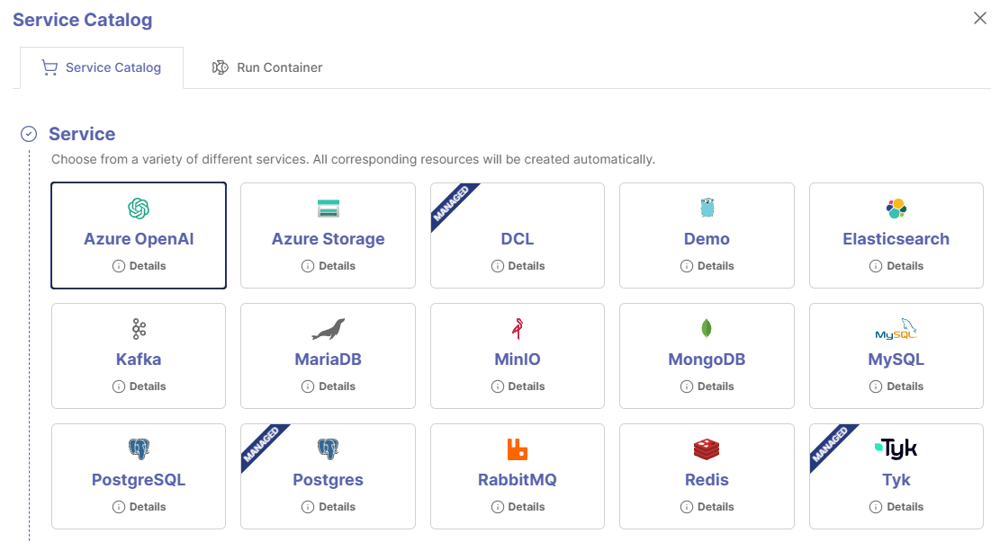

# Common Crossplane Self-Service Catalog Items

Crossplane configuration package containing multiple basic services like a PostgreSQL database for the Platform Plane self-service catalog.



## Repo Overview

- [package](./package/) This is the "root" folder for the Crossplane package that we build here, it consists of:
  - [configuration.yaml](./package/configuration.yaml) This yaml file (kind: Configuration) specifies that this is a Crossplane package, on which version of Crossplane it depends and which CRDs it provides.
  - [<catalog-item>](./package/redis/) For every catalog item, there is a subfolder containing the Crossplane composition and definition files.
- [Dockerfile](Dockerfile) The Dockerfile uses the Crossplane CLI to build and push the Crossplane configuration package (OCI image) to a registry (may be useful for local testing).
- [.github/workflows](./.github/workflows/build-publish-images.yaml) The GitHub pipeline calculates a version number and builds the Crossplane package on every commit.

## Update Strategy of Catalog Items

We assume that minor versions can be updated without breaking changes. This means that the `spec.forProvider.chart.version` field in the Crossplane configuration can be updated within the same minor version (read the release notes anyways to be sure). Note that there is usually a version mapping table defined at the beginning of the inline template mapping the major product versions to the corresponding Helm chart version. Applying a new version of this Crossplane configuration including new default values for Helm charts will replace the affected Helm releasees with the new version and therefore cause downtime and potentially issues for the customers! They can explicitly set the version (instead of relying on the default) to avoid this.

## Create the Crossplane package locally

### Via Dockerfile (no need to install Crossplane CLI)

Manually build the Dockerfile like (adjust the URLs to match Docker Hub if needed, not sure whether it works with Docker Hub though as I never successfully tested that):

```bash
REGISTRY_PASSWORD=... docker buildx build --progress=plain --secret id=registry-password,env=REGISTRY_PASSWORD --build-arg DOCKER_REGISTRY=index.docker.io --build-arg IMAGE_VERSION=0.0.1 --build-arg CACHEBUST=$(date +%s) --build-arg REGISTRY_IMAGE=index.docker.io/platformplane/platform-catalog .
```

The CACHEBUST is not really needed but useful when amending git commits or testing locally with the same version number.

### Via Crossplane CLI

```bash
cd package
echo $REGISTRY_PASSWORD | docker login -u $REGISTRY_USERNAME --password-stdin
crossplane xpkg build --package-file catalog-items.xpkg
crossplane xpkg push --package-files catalog-items.xpkg index.docker.io/platformplane/platform-catalog:0.0.1
```

## Catalog Integration

The Crossplane operator runs in the Platform space and watches the ConfigMap `crossplane` in the namespace `platformplane` which contains a list of Crossplane packages to be installed. This allows us to combine catalog items from different source (e.g. some "simple common" items from the platformplane Docker Hub, some Cloud Provider specific items from another repo and some project specific items from those respective registries).

```yaml
apiVersion: v1
kind: ConfigMap
data:
  packages.yaml: |
    - name: platform-catalog
      package: index.docker.io/platformplane/platform-catalog:0.1.0-rc.9
    - name: platform-catalog-azure
      package: index.docker.io/platformplane/platform-catalog-azure:0.1.0-rc.2
```

Please note that removing an entry from this list will not remove the Crossplane definitions (along with the CRDs and CRs). In case you want to remove all resources of a specific package (inlcuding all instances!), you need to delete the configuration package from `configurations.pkg.crossplane.io`.

If the packages are to be fetched from private registries, Crossplane needs package pull secrets (similar to ImagePullSecrets) to be able to pull the packages. These are provided by the platform (gitlab-operator). It creates the secret `default-registry` in the `crossplane-system` namespace similar to:

```bash
kubectl create secret docker-registry default-registry --docker-server=privateregistry.example.com --docker-username=spacename --docker-password=... -n crossplane-system
```

Furthermore, it adds the username and password again to the data section of this secret so that helm.crossplane.io/v1beta1 resources can reference it in their spec.forProvider.chart.pullSecretRef section.

The secret will look like this in the cluster:

```yaml
apiVersion: v1
kind: Secret
type: kubernetes.io/dockerconfigjson
data:
  username: Y29tbW9u
  password: Z2xw...
  .dockerconfigjson: >-
    eyJhdX.....
```

The encoded part is basically a docker config.json file:
  
```json
{
  "auths": {
    "privateregistry.example.com": {
      "username": "spacename",
      "password": "glpat-...",
      "auth": "..."
    }
  }
}
```

In order that the catalog actually shows your items, the Crossplane definition will need a specif label and some specific annotations (e.g. containing an encoded .svc catalog icon, description, etc.). Please refer to the existing items in the `package` folder for examples.

## How to add a new catalog item

- create a new subfolder in the `package` folder to develop your catalog item
- add your Crossplane composition and definition files
- verify that the pipeline builds the Dockerfile successfully
- use your own platformplane space to test your catalog item by manually applying/deleting the composition and definition files
- iterate until you are happy
- update the README.md file if needed
- create a merge request, assign it to a platform team member and ask for a review
- merge the merge request after it got approved
- coordinate the release with the platform team
  - tag the merge commit with a version number (e.g. `0.0.1`)
  - update the `crossplane` ConfigMap in the `platformplane` namespace on platform plane so that other developers can use it (via GitOps Repo)

## How to debug e.g. a new helm-based catalog item

See [here](https://docs.crossplane.io/latest/guides/troubleshoot-crossplane/)

- does the claim exist and what is its state? Describe it to see the status.
  ```yaml
  kubectl get dclconstellations
  kubectl describe dclconstellations sample-dclconstellation
  ```
- what is the state of the corresponding composite?
  ```yaml
  kubectl get dclconstellationcomposite
  kubectl get dclconstellationcomposite dclconstellation-sample-hx5hk -o jsonpath='{.status.conditions}'
  ```
- what is the state of the managed resource (in this case the helm release)?
  ```yaml
  kubectl get releases
  kubectl get release dclconstellation-sample-hx5hk-n5r6r -o jsonpath='{.status.conditions}'
  ```
- what is the status of the pkg.crossplane.io configurations?
  ```yaml
  kubectl get configurations
  kubectl get configuration platform-catalog -o jsonpath='{.status.conditions}'
  ```
- what is the status of the pkg.crossplane.io providers?
  ```yaml
  kubectl get providers
  kubectl get providers provider-helm -o jsonpath='{.status.conditions}'
  ```

## Useful commands to test items

### Elasticsearch

```bash
curl http://elasticsearch-sample:9200/_cluster/health?pretty
curl -X PUT "http://elasticsearch-sample:9200/my-index"
curl -X GET "http://elasticsearch-sample:9200/_cat/indices?v"
```

### Kafka

```bash
code client.properties
# paste the following content
security.protocol=SASL_PLAINTEXT
sasl.mechanism=PLAIN
sasl.jaas.config=org.apache.kafka.common.security.scram.ScramLoginModule required \
    username="user" \
    password="$(kubectl get secret kafka-user-passwords --namespace test -o jsonpath='{.data.client-passwords}' | base64 -d | cut -d , -f 1)";
# save the file and run the following commands
kubectl run kafka-kafka-client --restart='Never' --image docker.io/bitnami/kafka:3.7.0-debian-12-r0 --namespace test --command -- sleep infinity
kubectl cp --namespace test ./client.properties kafka-kafka-client:/tmp/client.properties
kubectl exec --tty -i kafka-kafka-client --namespace test -- bash
kafka-console-producer.sh \
            --producer.config /tmp/client.properties \
            --broker-list kafka-sample:9092 \
            --topic test
# write some stuff to topic
kafka-console-consumer.sh \
            --consumer.config /tmp/client.properties \
            --bootstrap-server kafka-sample:9092 \
            --topic test --from-beginning
# wait until topic content is shown
```

### MariaDB

```bash
kubectl exec -it maria-0 -n test -- mysql -u root -p db
```

### MinIO

```bash
mc alias set myminio http://minio-sample:9000 admin kPUMn2JZTc
mc mb myminio/bucket
mc ls myminio
```

### MsSql

```bash
kubectl run -n test -it --rm --image=mcr.microsoft.com/mssql-tools bash
sqlcmd -S mssql-sample -U sa
```

### Redis

```bash
redis-cli -h redis-master -p 6379 -a bLaesXrA1V
```

### PostgreSQL

```bash
kubectl run -n test -it --rm --image=postgres:latest postgres-client -- psql -h 10.96.193.248 -U postgres -d postgres --password
```

## Known issues

- console intregration does not offer all options shown in UI and sometimes does not seem to show all connection information
- Several charts (elastic, kafka, mariadb, MsSql which is plain yaml) do not provide the `persistentVolumeClaimRetentionPolicy` parameter which is needed to remove the PVCs when the Helm release is deleted. Therefore, the crossplane operator removes them manually after the catalog item removal. Alternatively, we could create our own PCV with Crossplane as part of the composition and reference that as existingClaim in the Helm release.

### Redis

- `consoel redis client` is not authenticating correctly, see error message when calling e.g. `INFO` command

## Work with functions

Read the article about [Composition Funcitons](https://docs.crossplane.io/latest/concepts/composition-functions/) and the [function-go-tempalting Readme](https://github.com/crossplane-contrib/function-go-templating). Sometimes, also the [Composition Functions design doc](https://github.com/stevendborrelli/crossplane/blob/master/design/design-doc-composition-functions.md) is useful. Regarding the templating syntax, use the [Go Helm template functions doc](https://helm.sh/docs/chart_template_guide/function_list).

```bash	
crossplane beta render examples/mssql-2022.yaml package/mssql/composition.yaml docs/functions.yaml > out.yaml
```

Debugging to see which keys are available: print this stuff you look for as connectiondetails:
  
  ```yaml
  resources1: {{- range $key, $value := .observed.resources.info.resource.status.atProvider.manifest.data.resourcegroup -}}{{- if $value -}}{{- printf "%s," $key -}}{{- end -}}{{- end -}}
  ```

  Then an error including the keys is shown in the managed resource status.

## GitHub Action Prerequisites

Add REGISTRY_URL index.docker.io to the variables section and DOCKERHUB_TOKEN and DOCKERHUB_USERNAME to the secrets section of the GitHub repository settings.

## Further improvements

- add OracleDB and SQLServer catalog item
- Show "danger" emoji at spec.version saying that this may break the application and migration has to be done potentially
- Make the crossplane operator watching the `crossplane` ConfigMap in the `platformplane` namespace (not copying the file on startup using that value until the pod is killed)
- add dependabot to the repo
