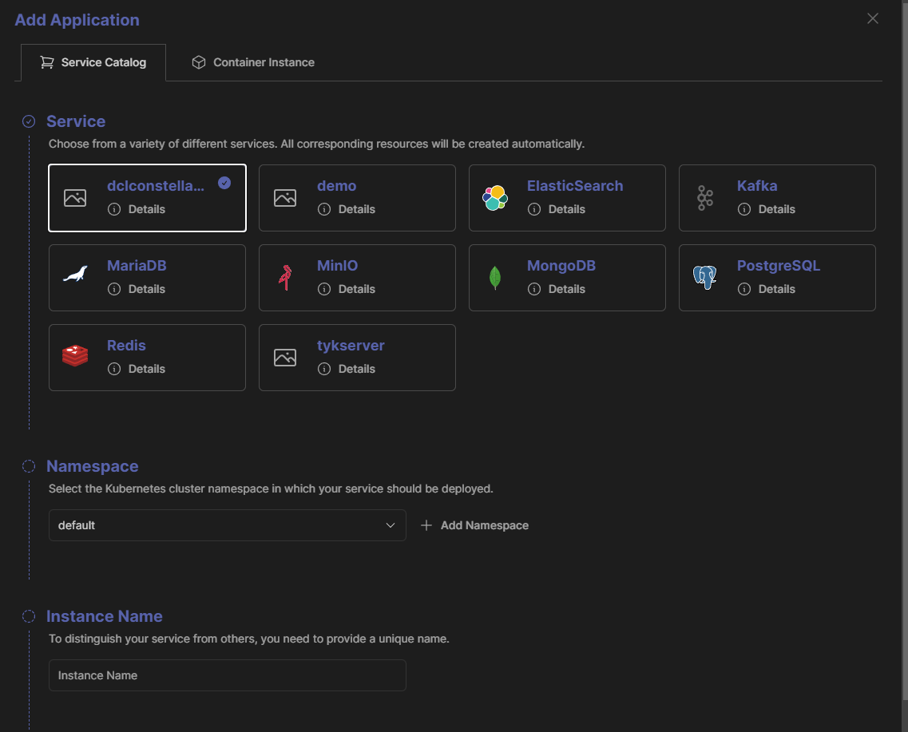

# catalog-items

The items shown in the catalog v2 are developed here.



## Repo Overview

- [package](./package/) This is the "root" folder for the Crossplane package that we build here, it consists of:
  - [configuration.yaml](./package/configuration.yaml) This yaml file (kind: Configuration) specifies that this is a Crossplane package, on which version of Crossplane it depends and which CRDs it provides.
  - [<catalog-item>](./package/redisserver/) For every catalog item, there is a subfolder containing the Crossplane composition and definition files.
- [Dockerfile](Dockerfile) The Dockerfile uses the Crossplane CLI to build and push the Crossplane configuration package (OCI image) to a registry (may be useful for local testing).
- [.github/workflows](./.github/workflows/build-publish-images.yaml) The GitHub pipeline calculates a version number and builds the Crossplane package on every commit.

## Create the Crossplane package locally

### Via Dockerfile (no need to install Crossplane CLI)

Manually build the Dockerfile like (adjust the URLs to match Docker Hub if needed, not sure whether it works with Docker Hub though as I never successfully tested that):

```bash
REGISTRY_PASSWORD=glpat-... docker buildx build --progress=plain --secret id=registry-password,env=REGISTRY_PASSWORD --build-arg DOCKER_REGISTRY=registry.nimbusplane.io --build-arg IMAGE_VERSION=0.0.1 --build-arg CACHEBUST=$(date +%s) --build-arg REGISTRY_IMAGE=registry.nimbusplane.io/common/lgt/platform/catalog-items .
```

The CACHEBUST is not really needed but useful when amending git commits or testing locally with the same version number.

### Via Crossplane CLI

```bash
cd package
echo $REGISTRY_PASSWORD | docker login -u $REGISTRY_USERNAME --password-stdin
crossplane xpkg build --package-file catalog-items.xpkg
crossplane xpkg push --package-files catalog-items.xpkg index.docker.io/platformplane/platform-catalog:0.0.1
```

## Catalog Integration

The Crossplane operator runs in the Platform space and watches the ConfigMap `crossplane` in the namespace `platformplane` which contains a list of Crossplane packages to be installed. This allows us to combine catalog items from different source (e.g. some "simple common" items from the platformplane Docker Hub, and some Nimbus or LGT DEV specific items from their respective registries).

```yaml
apiVersion: v1
kind: ConfigMap
data:
  packages.yaml: |
    - name: platform-catalog
      package: index.docker.io/platformplane/platform-catalog:0.1.0-rc.9
    - name: catalog-items-nimbus
      package: registry.nimbusplane.io/common/lgt/platform/catalog-items:0.1.0-rc.2
```

If the packages are to be fetched from private registries, Crossplane needs package pull secrets (similar to ImagePullSecrets) to be able to pull the packages. This is done by the platform (gitlab-operator). It creates the secret `default-registry` in the `crossplane-system` namespace similar to:

```bash
kubectl create secret docker-registry default-registry --docker-server=registry.nimbusplane.io --docker-username=spacename --docker-password=glpat-... -n crossplane-system
```

Furthermore, it adds the username and password again to the data section of this secret so that helm.crossplane.io/v1beta1 resources can reference it in their spec.forProvider.chart.pullSecretRef section.

The secret will look like this in the cluster:

```yaml
apiVersion: v1
kind: Secret
type: kubernetes.io/dockerconfigjson
data:
  username: Y29tbW9u
  password: Z2xw...
  .dockerconfigjson: >-
    eyJhdX.....
```

The encoded part is basically a docker config.json file:
  
```json
{
  "auths": {
    "registry.nimbusplane.io": {
      "username": "spacename",
      "password": "glpat-...",
      "auth": "..."
    }
  }
}
```

In order that the catalog actually shows your items, you need to make sure the Crossplane compositions and definitions are in the correct API group and version. Furthermore, the definition will need some specific annotations (e.g. containing an encoded .svc catalog item, description, etc.) to be shown in the catalog. Please refer to the existing items in the `package` folder for examples.

## How to add a new catalog item

- create a new subfolder in the `package` folder to develop your catalog item
- add your Crossplane composition and definition files
- verify that the pipeline builds the Crossplane package successfully
- use e.g. lgtdev.com to test your catalog item
  - add the package to the `crossplane` ConfigMap in the `platformplane` namespace
  - create a secret in the `crossplane-system` namespace to allow Crossplane to pull the package from the registry (if not anyways there already)
  - restart the Crossplane operator pod (in the platformplane namespace) (probably not needed!?)
  - check the catalog v2 UI for your new item
  - create a new instance of your catalog item via the UI
- iterate until you are happy
- if everything works, create a merge request, assign it to a Nimbus team member and ask for a review
- merge the merge request after it got approved
- if wanted tag the merge commit with a version number (e.g. `0.0.1`)
- coordinate the release with the Nimbus team who has to update the `crossplane` ConfigMap in the `platformplane` namespace on Nimbus so that other developers can use it

## How to debug e.g. a new helm-based catalog item
- does the claim exist and what is its state? Describe it to see the status.
  `k get dclconstellations`
- what is the state of the corresponding composite?
  `k get dclconstellationcomposite`
  `k get dclconstellationcomposite dclconstellation-sample-hx5hk -o jsonpath='{.status.conditions}'`
- what is the state of the helm release?
  `k get releases`
  `k get release dclconstellation-sample-hx5hk-n5r6r -o jsonpath='{.status.conditions}'`
- what is the status of the pkg.crossplane.io configurations?
  `k get configurations`
  `k get configuration catalog-items-lgtdev -o jsonpath='{.status.conditions}'`

## Further improvements

- add dependabot to the repo
- try out what happens when the platformplane does not install providers but instead let crossplane install them based on the dependencies in the configurations (the provider configs etc. will probably be needed anyways, with some default name references)
- test what happens when we install a new platform-catalog version that does not include an XRD anymore that was previously installed (will the resources be deleted?)
- use secret generator (e.g. in mssql) to generate the password secret
  - convert the patching to a crossplane function step in a pipeline (for the idea, see [here](https://github.com/23technologies/xp-fn-rndstr))
  - add another step to create the secret (but instead of what is done in the above example, use [this](https://github.com/crossplane-contrib/function-go-templating/tree/main) with [this improvement](https://github.com/crossplane/crossplane/issues/1895#issuecomment-1969733598)) or just use the go-template function and use [sprig](https://masterminds.github.io/sprig/crypto.html)
